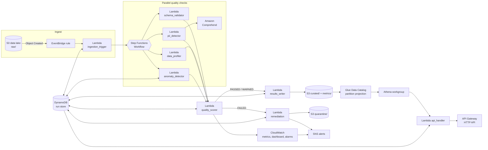

# Serverless Data Quality Pipeline

An AI-enhanced, fully serverless data quality pipeline on AWS. Files landing
in a data lake are automatically validated against schema contracts,
profiled, scanned for PII with **Amazon Comprehend**, and checked for
statistical anomalies — then routed to a curated zone or quarantined, with
every result queryable through **Athena** and a REST API.

The default configuration is tuned to run **inside the AWS Free Tier** —
see [Running it for free](#running-it-for-free).

## Architecture



### The eleven AWS services

| # | Service | Role in the pipeline |
|---|---------|----------------------|
| 1 | **S3** | Data lake zones: `raw/`, `curated/`, `quarantine/`, `metrics/`; schema contracts; Athena results |
| 2 | **EventBridge** | Watches the raw zone and fires the pipeline on every new object |
| 3 | **Lambda** | Nine functions: trigger, four checks, scorer, writer, remediation, API |
| 4 | **Step Functions** | Workflow fanning the checks out in parallel and routing on the verdict (Standard by default for free tier; Express via `workflow_type`) |
| 5 | **Comprehend** | AI-powered PII entity detection (plus language detection) on sampled cell text; free regex mode available |
| 6 | **DynamoDB** | Run store: per-run reports and per-dataset history (also the anomaly baseline) |
| 7 | **SNS** | Alerting channel for failed files, workflow crashes and CloudWatch alarms |
| 8 | **Glue** | Data Catalog database + metrics table with partition projection (no crawler runs needed); optional curated-zone crawler |
| 9 | **Athena** | SQL over the quality metrics (workgroup, named trend queries) |
| 10 | **CloudWatch** | Custom quality metrics, dashboard, failure alarms, all logs |
| 11 | **API Gateway** | HTTP API exposing run reports, dataset history and ad-hoc Athena queries |

X-Ray tracing is enabled across Lambda and Step Functions as a bonus.

## How a file flows through

1. A producer drops `raw/<dataset>/<file>.csv` into the lake bucket.
2. EventBridge matches the `Object Created` event and invokes
   `ingestion_trigger`, which registers a run in DynamoDB and starts the
   Express workflow.
3. Four checks run **in parallel**, each on a bounded sample of the file:
   - `schema_validator` — columns, types and required fields against the
     contract at `schemas/<dataset>.json` in the config bucket.
   - `data_profiler` — completeness, uniqueness, per-column statistics.
   - `pii_detector` — packs cell text into Comprehend
     `DetectPiiEntities` calls; unexpected PII columns are penalized and
     high-risk types (SSN, credit card, …) fail the file outright unless the
     contract's `pii_allowed` list expects them.
   - `anomaly_detector` — z-score outliers within the file plus volume
     drift against the dataset's own run history in DynamoDB.
4. `quality_scorer` combines the dimensions with weights
   (schema 0.35, PII 0.25, profile 0.20, anomaly 0.20) into an overall score
   and a verdict: `PASSED` / `WARNED` / `FAILED`, with hard-fail overrides
   for leaked high-risk PII and missing columns.
5. **PASSED/WARNED** → `results_writer` copies the file to `curated/` and
   appends a JSON metrics record to the Hive-partitioned `metrics/` prefix.
   **FAILED** (or a workflow error, via Catch) → `remediation` moves the
   file to `quarantine/` and publishes an SNS alert.
6. The metrics table is registered in the Glue Data Catalog with
   **partition projection**, so new metrics files are queryable in Athena
   immediately — no crawler runs. Two named trend queries ship with the
   stack ("which dataset's quality is trending down this month?").

## Repository layout

```
infrastructure/terraform/   All eleven services as Terraform (one file per service)
  templates/                Step Functions ASL definition (templated ARNs)
src/lambdas/<name>/         One directory per Lambda function
src/layers/common/          Shared Lambda layer (S3/DynamoDB/CloudWatch helpers)
tests/                      Unit tests for the pure check/scoring logic
samples/                    Example dataset + schema contract
```

## Deploy

Prerequisites: Terraform >= 1.5, AWS credentials, a region where Comprehend
is available (default `us-east-1`).

```bash
make apply                     # terraform init + apply
make seed                      # upload sample contract + trigger a sample run
```

Optionally subscribe to alerts:

```bash
terraform -chdir=infrastructure/terraform apply -var alert_email=you@example.com
```

## Use the API

```bash
API=$(terraform -chdir=infrastructure/terraform output -raw api_endpoint)

# Recent runs for a dataset
curl "$API/datasets/customers/runs"

# Full report for one run
curl "$API/runs/<run_id>"

# Ad-hoc trend query through Athena
curl -X POST "$API/query" -H 'content-type: application/json' -d '{
  "sql": "SELECT dataset, avg(overall_score) FROM metrics GROUP BY 1"
}'
```

> The `/query` route only accepts read queries and runs inside a workgroup
> with a 1 GiB scan cutoff. For production, put an authorizer on the API.

## Schema contracts

Quality expectations per dataset live at `schemas/<dataset>.json` in the
config bucket:

```json
{
  "columns": [
    {"name": "customer_id", "type": "integer", "required": true},
    {"name": "email",       "type": "string",  "required": true},
    {"name": "signup_date", "type": "date",    "required": true}
  ],
  "allow_extra_columns": false,
  "pii_allowed": ["email"]
}
```

Supported types: `string`, `integer`, `number`, `date`, `timestamp`,
`boolean`. Datasets without a contract pass the schema dimension with an
advisory `no_contract` flag, so onboarding a new feed never blocks it.

## Develop

```bash
pip install -r requirements-dev.txt
make test        # pure-logic unit tests, no AWS needed
make fmt         # terraform fmt
```

## Running it for free

The defaults are chosen so a light workload fits the AWS Free Tier:

| Service | Free tier | How this stack stays inside it |
|---------|-----------|--------------------------------|
| Lambda | 1M requests + 400K GB-s/month, always free | ~9 short invocations per file |
| Step Functions | 4,000 state transitions/month (Standard), always free | Default `workflow_type = STANDARD` ≈ 350 runs/month free; Express has no free tier |
| DynamoDB | 25 RCU/25 WCU provisioned, always free | Table provisioned at 5/5 |
| SNS | 1M publishes/month, always free | One publish per failure |
| EventBridge | AWS-service events free | S3 object events |
| CloudWatch | 10 custom metrics, 10 alarms, 5 GB logs, 3 dashboards | Emits 2 metrics/dataset by default; per-dimension scores opt-in via `emit_dimension_metrics` |
| Glue | Data Catalog: 1M objects/requests free | Metrics table uses partition projection — zero crawler runs; curated crawler off by default |
| S3 | 5 GB for 12 months | SSE-S3 encryption (no KMS charges) |
| API Gateway | 1M HTTP API calls for 12 months | — |
| Comprehend | 50K units/month for 12 months | Bounded sampling; or set `pii_detection_mode = "regex"` for the built-in Luhn-validated pattern matcher (free forever) |
| Athena | **No free tier** ($5/TB scanned) | Only runs when you query; 100 MiB/query cap bounds worst case to ≈ $0.0005 |

An idle deployment costs approximately nothing; a few hundred small files a
month stays free apart from fractions of a cent of Athena if you query.
To favor scale over free tier:

```bash
terraform -chdir=infrastructure/terraform apply \
  -var workflow_type=EXPRESS \
  -var emit_dimension_metrics=true \
  -var enable_curated_crawler=true
```
