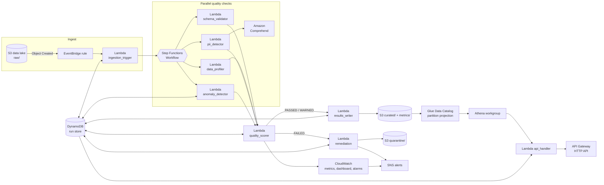

# Serverless Data Quality Pipeline (AWS Project)

This is my project where I built a serverless data quality pipeline on AWS.
The idea is simple: whenever a CSV file is uploaded to S3, the pipeline
automatically checks the file quality (schema, missing values, PII leaks,
anomalies) and then either accepts the file or quarantines it and sends an
alert. It uses **11 AWS services** and the AI part is **Amazon Comprehend**,
which detects personal information (PII) inside the data.

Best part: the default setup runs inside the **AWS Free Tier**, so you can
try it without spending money.

## What happens when a file is uploaded



In words:

1. You upload a CSV to `raw/<dataset>/` in the S3 bucket.
2. EventBridge notices the new file and calls a Lambda, which starts a
   Step Functions workflow.
3. Four checks run at the same time: schema validation, data profiling,
   PII detection (Comprehend), and anomaly detection.
4. A scorer Lambda combines the results into one score and a verdict:
   `PASSED`, `WARNED`, or `FAILED`.
5. Good files are copied to `curated/` and a metrics record is saved for
   Athena. Bad files are moved to `quarantine/` and SNS emails you.
6. You can see everything on a CloudWatch dashboard, query trends with
   Athena, or call the REST API.

## The 11 AWS services used

| # | Service | What I used it for |
|---|---------|--------------------|
| 1 | S3 | Data lake (raw/curated/quarantine/metrics zones) + schema contracts |
| 2 | EventBridge | Detects new files and triggers the pipeline |
| 3 | Lambda | 9 functions that do all the actual work |
| 4 | Step Functions | Runs the checks in parallel and routes on the verdict |
| 5 | Comprehend | The AI part — finds PII like emails, SSNs, card numbers |
| 6 | DynamoDB | Stores every run and the history per dataset |
| 7 | SNS | Sends alert emails when a file fails |
| 8 | Glue | Data Catalog so Athena knows the metrics table schema |
| 9 | Athena | SQL queries over the quality metrics |
| 10 | CloudWatch | Custom metrics, dashboard, and alarms |
| 11 | API Gateway | REST API to fetch reports and run queries |

## Folder structure

```
infrastructure/terraform/   All the AWS resources (one file per service)
  templates/                The Step Functions workflow definition
src/lambdas/<name>/         One folder per Lambda function
src/layers/common/          Shared helper code (Lambda layer)
tests/                      Unit tests (run without AWS)
samples/                    Example CSV + schema contract to try it out
```

## How to run this project

### What you need first

- An AWS account (free tier is fine)
- [Terraform](https://developer.hashicorp.com/terraform/install) 1.5 or newer
- [AWS CLI](https://aws.amazon.com/cli/) configured with your credentials
  (`aws configure`)
- Python 3.12 (only needed for running the tests locally)

### Step 1 — Clone the repository

```bash
git clone https://github.com/prakshe23/Serverless-Data-Quality.git
cd Serverless-Data-Quality
```

### Step 2 — Run the unit tests (optional but nice)

This checks the validation/scoring logic works. No AWS needed.

```bash
pip install -r requirements-dev.txt
make test
```

You should see `28 passed`.

### Step 3 — Deploy everything to AWS

```bash
make apply
```

Terraform will show you a plan — type `yes` to confirm. It creates all 11
services in `us-east-1` (Comprehend must be available in the region, so
keep the default unless you know your region has it).

If you want failure alert emails, deploy with your email:

```bash
terraform -chdir=infrastructure/terraform apply -var alert_email=you@example.com
```

AWS will send you a confirmation email — click the link in it, otherwise
SNS will not deliver alerts.

### Step 4 — Upload the sample schema contract and test file

```bash
make seed
```

This does two things:
1. Uploads `samples/schemas/customers.json` to the config bucket. This is
   the "contract" that says what columns the `customers` dataset must have.
2. Uploads `samples/customers.csv` to `raw/customers/` in the lake bucket —
   which immediately triggers the pipeline!

### Step 5 — Watch the pipeline run

Go to the AWS console → **Step Functions** → the `data-quality-dev-workflow`
state machine. You should see an execution that ran the four checks in
parallel. Or open the CloudWatch dashboard (Terraform prints the URL):

```bash
terraform -chdir=infrastructure/terraform output dashboard_url
```

### Step 6 — Check the result in S3 and DynamoDB

The sample file is clean, so it should be `PASSED`:

- In the lake bucket you'll now see `curated/customers/customers.csv`
  (the promoted file) and a JSON record under `metrics/year=.../`
- The DynamoDB table `data-quality-dev-runs` has the full run report

### Step 7 — Try the REST API

```bash
API=$(terraform -chdir=infrastructure/terraform output -raw api_endpoint)

# Recent runs for the customers dataset
curl "$API/datasets/customers/runs"

# Full report for one run (copy a run_id from the previous response)
curl "$API/runs/<run_id>"

# Ask Athena a question over all metrics
curl -X POST "$API/query" -H 'content-type: application/json' -d '{
  "sql": "SELECT dataset, avg(overall_score) FROM metrics GROUP BY 1"
}'
```

### Step 8 — Make a file fail (the fun part)

Create a bad CSV — wrong column name and a missing required value:

```bash
cat > bad.csv <<'EOF'
customer_id,email_address,signup_date,plan,monthly_spend
1,alice@example.com,2026-01-15,pro,49.00
2,,2026-02-02,basic,9.00
EOF

aws s3 cp bad.csv \
  s3://$(terraform -chdir=infrastructure/terraform output -raw lake_bucket)/raw/customers/bad.csv
```

The schema validator sees `email` is missing (it's called `email_address`
here), which is a hard fail. The file goes to `quarantine/customers/` and
you get an SNS email with the reason. Check the DynamoDB record — the
verdict will be `FAILED`.

### Step 9 — Add your own dataset

1. Write a contract for it (copy `samples/schemas/customers.json` and edit
   the columns). Supported types: `string`, `integer`, `number`, `date`,
   `timestamp`, `boolean`. If a column is *supposed* to contain PII (like
   an email column), list it in `pii_allowed` so it doesn't get flagged.
2. Upload the contract to the config bucket as `schemas/<dataset>.json`.
3. Upload files to `raw/<dataset>/` — done.

(If you skip the contract, the file still runs through the pipeline; the
schema check just passes with a `no_contract` note.)

### Step 10 — Clean up when you're done

```bash
make destroy
```

This deletes all the AWS resources so nothing keeps running in your account.

## How it stays inside the Free Tier

| Service | Free tier | What I did to stay inside it |
|---------|-----------|------------------------------|
| Lambda | 1M requests/month, always free | ~9 short invocations per file |
| Step Functions | 4,000 transitions/month (Standard), always free | Default is Standard ≈ 350 runs/month free; Express has no free tier |
| DynamoDB | 25 RCU/25 WCU provisioned, always free | Table is provisioned at 5/5 |
| SNS | 1M publishes/month, always free | One publish per failure |
| EventBridge | AWS-service events are free | S3 object events |
| CloudWatch | 10 custom metrics, 10 alarms, 3 dashboards | Only 2 metrics per dataset by default |
| Glue | Data Catalog is free | Partition projection instead of crawlers (crawler runs cost money) |
| S3 | 5 GB for 12 months | SSE-S3 encryption, no KMS charges |
| API Gateway | 1M calls for 12 months | — |
| Comprehend | 50K units/month for 12 months | Small bounded samples; or set `pii_detection_mode = "regex"` for a free-forever pattern matcher |
| Athena | No free tier ($5/TB scanned) | Only bills when you query; capped at 100 MiB/query ≈ $0.0005 worst case |

If you outgrow the free tier and want more scale:

```bash
terraform -chdir=infrastructure/terraform apply \
  -var workflow_type=EXPRESS \
  -var emit_dimension_metrics=true \
  -var enable_curated_crawler=true
```

## Things I learned / design decisions

- **Why Step Functions parallel state:** the four checks don't depend on
  each other, so running them in parallel makes the pipeline as slow as the
  slowest check instead of the sum of all four.
- **Why sampling:** Lambdas read at most ~16 MB / 5,000 rows of a file.
  Full-file scanning belongs in a heavier tool; for quality *signals*,
  a sample is enough and keeps everything fast and cheap.
- **Hard-fail gates:** a good weighted score shouldn't save a file that
  leaks SSNs or is missing a required column, so those override the score.
- **Partition projection over crawlers:** since I control the metrics
  folder layout (`year=/month=/day=`), Athena can compute the partitions
  itself — no crawler needed, which is both faster and free.
- **Anomaly baseline from DynamoDB:** each dataset's own history is the
  baseline, so a feed that suddenly sends 10x fewer rows gets flagged even
  if every row is individually valid.
